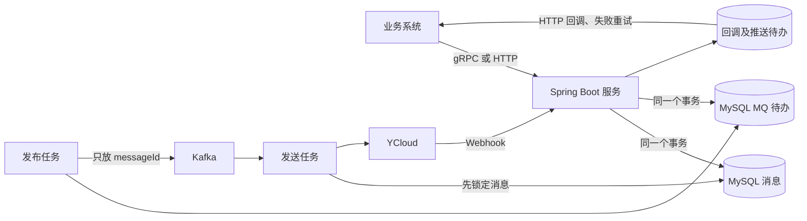

# qc-meta-service-spring

这是专门对接 YCloud 的 Java 21 / Spring Boot 服务，只负责消息发送、平台查询、素材传输和可靠回调中转。号码与业务归属、配置保存、客户会话、联系入口和统计都由 `boke-kefu` 负责。当前接入变化见 [中转边界与初始化](docs/relay-boundary.md)。

部署方式为单体、单实例：每个环境只运行一个 JVM 进程，当前不考虑多节点、多实例或水平扩容。实例内可以并发处理任务；消息幂等、事务和恢复逻辑用于保障并发处理及服务重启后的可靠性。

分类接口文档见 [docs/api.md](docs/api.md)，飞书版见 [接口说明与实施验收](https://boke.feishu.cn/docx/WM3tdrQ9LoqFZFxujeCcLPZGnEb)。新增服务协议统一维护在 `src/main/proto/qc/meta/v1/meta.proto`。消息返回本地编号；YCloud 原始事件通过 HTTP 回调推送给 boke-kefu，本地发送/素材状态事件仍可使用 `pull → 本地保存 → confirm`。飞书历史文档尚未同步此次边界调整，以本地文档为准。

## 使用的技术

| 技术 | 版本/做法 | 用途 |
| --- | --- | --- |
| Java | JDK 21 | 服务开发和运行 |
| Spring Boot | 3.5.7 | HTTP、配置、数据库、监控和应用生命周期 |
| MySQL | 8.4 | 保存发送任务、回调和可靠投递进度 |
| MyBatis | Spring Boot Starter 3.0.5 | 按业务拆分 Mapper/XML，管理 SQL、命名参数和结果映射 |
| Kafka | 客户端和 Broker 2.6.3 | 分发发送任务 |
| gRPC Java | 1.75.0 | 新业务系统之间的调用 |

Kafka 使用 Apache 官方 Java 客户端直接连接 Broker。发布使用幂等生产者并等待全部同步副本确认；消费者关闭自动提交，业务处理完成后才提交 offset。消费处理失败时回退到原记录，MySQL 状态负责防止重复发送。

数据库访问使用 MyBatis Mapper 接口和 XML，Java 保留业务判断与事务边界；优先使用通用 SQL，必要的 MySQL JSON、分页和领取语法集中在 XML。模块划分、SQL 维护方式和保留的数据库差异见 [数据库访问与 SQL 维护说明](docs/database-access.md)。

## 消息流程



完整手机号和消息正文保存在 MySQL。Kafka 里只放 `messageId`，减少敏感数据副本。Kafka 可能重复投递，所以发送任务先检查并锁定 MySQL 消息；已经处理的消息会直接跳过。

YCloud 明确返回 429 时可以安全重试。网络超时、返回内容无法读取或 5xx 都无法确认 YCloud 是否已经收到了消息，这些情况会进入 `UNKNOWN`，等待 Webhook 或人工核对，不会直接重发。

## 已支持的功能

| 功能 | 具体作用 | 主要数据 |
| --- | --- | --- |
| 发送消息 | 保存请求并通过 Kafka 异步调用 YCloud | 请求编号、业务、发送号码、收件人、消息内容、发送时间 |
| 多种内容 | 文本、模板、图片、视频、音频、文件、贴纸、位置、交互、联系人、表情回应 | `content.type` 和对应内容字段 |
| 延时发送 | 到 `sendAt` 后才发布 Kafka 任务 | `sendAt`、`next_publish_at` |
| 防重复提交 | 同一业务下相同请求编号返回原消息 | `businessId`、`sendRequestId` |
| 批量活动 | 把一个模板活动拆成多条收件人消息 | 活动编号、模板、语言、收件人列表 |
| 平台资料 | 按需实时查询 YCloud 账号、号码和模板，不保存配置副本 | 调用方提供 `wabaId`、号码或模板键 |
| 状态回调 | 验签、保存、向 boke-kefu 推送；匹配本地任务时更新状态 | 事件编号、消息编号、状态、发生时间 |
| 业务事件 | 业务系统顺序读取并确认回调 | 顺序号、事件类型、业务、原始内容 |
| 监控 | 健康检查和 Prometheus 指标 | MySQL、Kafka、配置、积压量、调用结果 |

YCloud 账号开通、WhatsApp 号码注册、模板审核和媒体文件管理仍在 YCloud 平台完成。

## 快速启动

只安装 Docker Desktop 也可以运行：

```powershell
cd D:\work\game-support\tech\qc-meta-service-spring
docker compose up -d mysql
```

本地参数直接写在 `docker-compose.yml` 和对应的独立配置文件中，不需要生成或填写 `.env`。修改数据库密码时，保持 MySQL 容器配置、Compose 的应用数据库配置和 dev 数据库文件一致。

数据库由人工管理，应用不会自动建表或升级。各环境从空库初始化，只需执行 [init.sql](deployment/sql/init.sql)，直接创建当前 7 张表。本地旧库可由开发者删除重建，不再保留历史升级或清理脚本，具体步骤见 [SQL 执行说明](deployment/sql/README.md)。

OSS 始终启用，启动前按 [分环境配置说明](docs/environment-config.md) 使用 `src/main/resources/dev/oss.cla`（已迁入旧 WhatsAppService 的开发配置），格式兼容旧项目的 `ClaUtil`。Compose 将 `src/main/resources/dev` 只读挂载到容器 `/app/dev`；缺少文件或不能解密时会拒绝启动。数据库与配置文件准备好后启动完整服务：

```powershell
docker compose up -d --build
```

Compose 的端口映射直接写在 `docker-compose.yml` 中：HTTP 为 `18080:8910`，gRPC 为 `9090:8920`，右侧与公共 application.yml 中的监听端口一致。直接运行 Java 时，HTTP 使用 8910，gRPC 使用 8920。

常用地址：

| 地址 | 用途 |
| --- | --- |
| `http://localhost:18080/health/live` | Compose 实例进程是否存活 |
| `http://localhost:18080/health/ready` | Compose 实例的 MySQL、Kafka、YCloud 和下游回调配置是否就绪 |
| `http://localhost:18080/metrics` | Compose 实例的 Prometheus 指标 |
| `127.0.0.1:9092` | Kafka 本机连接地址 |
| `localhost:9090` | Compose 实例的 gRPC 服务；直接启动为 `localhost:8920` |
| `http://localhost:18080/webhooks/ycloud` | Compose 实例的 YCloud Webhook |

启动前在公共 `src/main/resources/application.yml` 的 `ycloud` 下填写 API Key 和 Webhook Secret，并在 `downstream.callback-url` 填写 boke-kefu 接收地址，所有环境共用这份配置，不需要加密或调用配置接口。未填写时存活检查可以成功，就绪检查会提示配置未完成；填写后重新构建并重启服务。

停止并删除本地数据：

```powershell
docker compose down -v
```

## 只启动本地 Kafka

本机开发使用 Apache Kafka 2.6.3，单节点 Broker + ZooKeeper 模式。镜像由 `deployment/kafka/` 使用 Apache 发行包和 SHA-512 校验构建，业务应用保持 JDK 21。消息存放在独立 Docker 数据卷，Docker Desktop 重启后 Kafka 会自动启动。

```powershell
docker compose up -d kafka kafka-init
docker compose ps -a
```

| 内容 | 地址或名称 |
| --- | --- |
| 本机 IP / 局域网 bootstrap servers | `172.18.64.68:9092` |
| Windows 本机回环 bootstrap servers | `127.0.0.1:9092`（后续 Broker 连接使用本机 IP） |
| 同一个 Compose 网络内的服务 | `kafka:19092` |
| Docker 网络 | `qc-meta-service-spring_default` |
| 发送 Topic | `qc-meta-message-send-v1`，4 个分区，1 副本 |
| 消费组 | `qc-meta-sender` |
| 持久化数据卷 | `qc-meta-service-spring_qc-meta-spring-kafka26-data` |

端口绑定本机回环地址和当前局域网 IP `172.18.64.68`。外部监听器向客户端返回 `172.18.64.68:9092`，所以通过回环地址建立初始连接后也需要能访问该 IP。其他项目的容器可以加入上述 Docker 网络，通过 `kafka:19092` 连接。本配置采用 PLAINTEXT、单副本，供可信内网使用；其他机器访问还需网络和 Windows 防火墙允许 TCP 9092。

本机 IP 变化时，同步修改 `docker-compose.yml` 中的 `QC_KAFKA_ADVERTISED_HOST` 和对应端口绑定地址，再执行 `docker compose up -d --build --no-deps kafka`。只修改客户端的 bootstrap servers 不会改变 Broker 返回的地址。

```powershell
# 查看 Topic 和分区
docker compose exec kafka /opt/kafka/bin/kafka-topics.sh --bootstrap-server kafka:19092 --describe --topic qc-meta-message-send-v1
# 查看消费进度
docker compose exec kafka /opt/kafka/bin/kafka-consumer-groups.sh --bootstrap-server kafka:19092 --describe --group qc-meta-sender
# 停止或恢复，保留数据
docker compose stop kafka zookeeper
docker compose up -d kafka kafka-init
```

## 消息队列

当前统一使用 Kafka；各环境按新库初始化，不需要执行旧队列待办迁移 SQL。历史切换记录见 [Kafka 说明](docs/kafka-migration.md)。

## 不使用 Docker 开发

本机安装 JDK 21 和 Maven 3.9 后执行：

```powershell
mvn -B -ntp clean package
mvn spring-boot:run
```

MySQL 和 Kafka 可以通过 Docker 单独启动。默认 dev，其他环境通过 `--spring.profiles.active=<环境>` 选择。dev、beta 的数据库和 OSS 文件随项目放在 resources 中；只有 dx、prod 使用外置配置。数据库、OSS 独立文件和每个环境的 Kafka 参数见 [分环境配置说明](docs/environment-config.md)。

### gRPC 生成代码与 IDE 导入

`com.boke.qcmeta.grpc.v1` 由 `src/main/proto/qc/meta/v1/meta.proto` 中的 `java_package` 指定。这个包由 Maven 的 `protobuf-maven-plugin` 自动生成，不在 `src/main/java` 中手工维护：

| 生成目录 | 内容 |
| --- | --- |
| `target/generated-sources/protobuf/java` | 消息、请求和响应类型，如 `SubmitMessageRequest` |
| `target/generated-sources/protobuf/grpc-java` | gRPC 服务基类和客户端 Stub，如 `MessageServiceGrpc` |

首次导入项目，或修改 Proto 后，可先单独生成 Java 代码：

```powershell
mvn -B -ntp generate-sources
```

`mvn -B -ntp clean package` 也会执行这两个生成步骤。`target/` 是构建目录，已被 Git 忽略；执行 `clean` 后需要重新生成。Docker 构建只在镜像内生成代码，不会将生成结果写回本机项目目录。

IntelliJ IDEA 请按 Maven 项目导入 `pom.xml`，使用 JDK 21，在 Maven 工具窗口执行 `generate-sources` 后重新加载 Maven 项目。如果引用仍未识别，检查上面两个目录是否被识别为生成源码目录，必要时将它们标记为 `Generated Sources Root`。不要将生成类复制到 `src/main/java`，协议变更应修改 Proto 后重新生成。

## 启动配置

配置文件直接填写具体值，修改后需要重启服务。切换环境使用启动参数 `--spring.profiles.active=dev`，环境可选 dev、beta、dx、prod。

| 配置位置 | 配置项 | 作用 |
| --- | --- | --- |
| `application.yml` | `server.port`、`qc.grpc-port` | HTTP 端口 8910、gRPC 端口 8920 |
| `application.yml` | `downstream.callback-url`、`downstream.request-timeout` | boke-kefu 回调地址（未提供时留空）与 HTTP 超时（默认 5s） |
| `application.yml` | `qc.shutdown-timeout` | 停机等待时间，默认 15s |
| `application.yml` | `ycloud.base-url`、`api-key`、`webhook-secret`、`request-timeout` | 所有环境共用的 YCloud 配置，直接填写明文，默认地址为 https://api.ycloud.com、超时为 15s |
| `application-环境.yml` | `qc.kafka.enabled` | 是否启动 Kafka 客户端，默认 true |
| `application-环境.yml` | `qc.kafka.bootstrap-servers` | dev 为 `127.0.0.1:9092`；其他环境填写实际地址 |
| `application-环境.yml` | `qc.kafka.topic`、`producer-client-id`、`consumer-group` | 当前环境的发送主题、客户端名称和消费组 |
| `application-环境.yml` | `qc.kafka.concurrency` | 实例内消费线程数，默认 4，有效并发受分区数和message.worker-count 限制 |
| 各环境独立数据库文件 | `spring.datasource.*` | MySQL 地址、账号、密码和连接池参数 |
| 各环境 `oss.cla` | `oss.config.*`、`qc.assets.*` | 加密保存的 OSS 和文件访问参数 |
| `docker-compose.yml` | `ports`、`configs.app-database.content` | Docker 端口映射及容器内应用数据库连接参数 |

beta 数据库、OSS 的必填参数，以及 beta、dx、prod 的 Kafka 地址目前为空，部署前填写实际值。

服务仅在可信内网使用，HTTP/gRPC 无需附带管理或业务 Token。Protobuf 是序列化格式，本身不加密；需要传输加密时由部署层提供 TLS。OSS 必须提供有效的 `oss.cla`。

## 固定运行参数

以下 8 项统一保存在公共 `application.yml`，启动时读取并校验，修改后重启生效。没有数据库配置表、历史版本、在线修改或回滚接口，也没有配置刷新查询。

| 配置键 | 默认值 | 作用 |
| --- | --- | --- |
| `message.worker-count` | `4` | 同时处理的发送任务数 |
| `message.sender-rate` | `10` | 每个发送号码每秒最多启动的发送次数 |
| `message.poll-interval` | `500ms` | MQ 待办查询和发布任务的执行间隔 |
| `message.claim-timeout` | `2m` | 发送进程异常后消息保持锁定的时间 |
| `message.max-safe-retries` | `5` | YCloud 明确限流时的安全重试上限 |
| `webhook.signature-tolerance` | `5m` | 签名时间与本机时间允许的差值 |
| `webhook.max-body-bytes` | `2097152` | Webhook 请求体最大字节数 |
| `events.retention-days` | `30` | 已确认下游事件保留天数 |

消息锁定时间必须比 `ycloud.request-timeout` 至少长 5 秒。非法参数会阻止启动，避免带着错误的并发、限速或验签参数运行。

退订和黑名单由 boke-kefu 在提交前判断，本服务不再提供两个全局过滤开关。为兼容已有调用，请求字段 `filterUnsubscribed`、`filterBlocked` 仍保留：ASYNC 省略时为 false，显式值只作为 YCloud 过滤参数透传；DIRECT 仍拒绝显式 true。已入库消息沿用原来的参数，相同请求重试返回原记录。

## HTTP 接口

所有管理和业务接口均可由内网直接调用，无需 Authorization。YCloud Webhook 仍须验签，业务归属校验和事件租约保持不变。

平台接口直接查询或修改 YCloud 的 WABA、号码和模板，不维护本地号码绑定。接口列表见 [号码与模板](docs/api-management.md)。

业务接口：

| 方法和路径 | 用途 |
| --- | --- |
| `POST /api/v1/messages` | 提交一条消息 |
| `GET /api/v1/messages/{messageId}` | 查询消息和状态 |
| `POST /api/v1/campaigns` | 创建模板群发活动 |
| `GET /api/v1/campaigns/{campaignId}` | 查询活动统计 |
| `POST /api/v1/campaigns/{campaignId}/cancel` | 取消还没有交给 YCloud 的消息 |
| `GET /api/v1/events?businessId=...` | 检查未确认事件，不作为消费进度 |
| `POST /api/v1/events/pull` | 领取待处理事件和租约凭证 |
| `POST /api/v1/events/confirm` | 本地持久化后按租约确认 |

gRPC 提供相同功能，定义在 `src/main/proto/qc/meta/v1/meta.proto`。新系统优先使用 gRPC；HTTP 用于旧系统过渡和人工联调。

## 主要数据表

| 表 | 保存的内容 |
| --- | --- |
| `assets` | 文件传输状态、OSS 链接和平台媒体编号 |
| `outbound_messages` | 收件人、消息正文、当前状态和 YCloud/WhatsApp 消息编号 |
| `mq_outbox` | 等待发布到 Kafka 的 `messageId` 和下次发布时间 |
| `campaigns` | 批量模板活动及统计 |
| `submission_attempts` | 每次调用 YCloud 的结果，不保存密钥 |
| `provider_events` | YCloud 原始回调、防重和下游 HTTP 推送进度 |
| `event_outbox` | 等待业务系统读取和确认的事件 |

详细字段和索引在 `deployment/sql` 中。数据库初始化由人工核对并执行，说明见 [数据库脚本](deployment/sql/README.md)。应用不依赖 Flyway，启动时不运行 SQL 初始化脚本；新空库只执行 init.sql，直接创建 7 张运行表，详见 [中转边界与升级](docs/relay-boundary.md)。

## 监控重点

| 指标 | 表示什么 |
| --- | --- |
| `qc_meta_messages_submitted_total` | API 接收的消息数 |
| `qc_meta_kafka_publish_total` | 发布 Kafka 成功和失败次数 |
| `qc_meta_kafka_consume_total` | MQ 任务领取、跳过和数据库错误次数 |
| `qc_meta_mq_outbox_pending` | MySQL 中还没发布成功的 MQ 待办数 |
| `qc_meta_worker_in_flight` | 当前正在处理的发送任务数 |
| `qc_meta_ycloud_requests_total` | YCloud 请求结果 |
| `qc_meta_webhook_events_total` | Webhook 验签和处理结果 |
| `qc_meta_webhook_forward_total` | 下游 HTTP 推送接受或重试次数 |
| `qc_meta_event_outbox_pending` | 业务系统还没确认的事件数 |

## 构建检查

使用 JDK 21 和 Maven 编译、打包：

```powershell
mvn -B -ntp clean package
```

本机没有 JDK 21 或 Maven 时，可执行 `docker compose build app`，由构建容器完成相同检查。接口联调使用 [Postman 集合](docs/postman/README.md)。之前的测试与部署结果作为历史记录保存在 [验证记录](docs/validation.md)。

## 目录

```text
src/main/proto/                  gRPC 定义
src/main/java/.../api/           HTTP 接口和参数校验
src/main/java/.../grpc/          gRPC 服务
src/main/java/.../message/       消息校验、MQ 待办发布和发送任务
src/main/java/.../queue/         Kafka 连接、发布和消费
src/main/java/.../ycloud/        YCloud 请求转换和 HTTP 客户端
src/main/java/.../webhook/       回调验签和事件处理
src/main/java/.../store/         数据操作编排、归属校验与事务
src/main/java/.../mapper/        MyBatis Mapper 接口与类型转换
src/main/java/.../model/db/      类型化写入参数、查询条件和数据库结果
src/main/resources/mapper/      按业务分类的 SQL 与公共查询片段
src/main/java/.../config/        启动配置校验和密钥加密
deployment/sql/                  人工执行的建表、结构差异和数据调整 SQL
deployment/kafka/                Kafka 2.6.3 与 ZooKeeper 镜像构建
deployment/rocketmq/             旧 RocketMQ 配置存档
scripts/                         OSS/数据库文件加密和历史配置迁移工具
```
